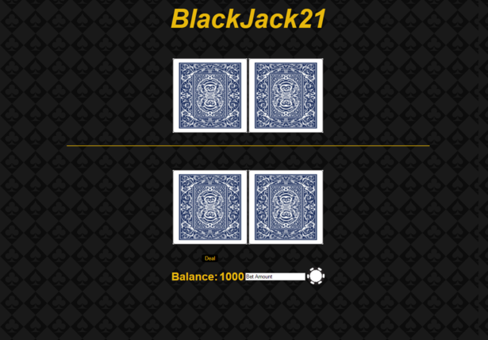

#  Blackjack 
#### &nbsp;&nbsp;&nbsp;&nbsp;This is a blackjack game written in HTML, CSS, and Javascript. This application allows the user to play a game of blackjack just by opening the HTML file or by visiting a url if one so chooses to host it on a webserver. The game uses a numerical balance(Not a monetary balance. You cannot gamble real money.), and the player is given an initial balance of 1000. To begin playing, simply place your bet by entering how much you'd like to bet in the textbox and then by pressing the black and white chip. After the bet is placed, press the deal button for both player's and dealer's hands to be issued. The player may then choose to either hit or stand. In this version of blackjack, there is no option to buy insurance. The player may continue to play until they bust. If the player busts, they may restart the game by refreshing the webpage.

# 

# Running the Game
